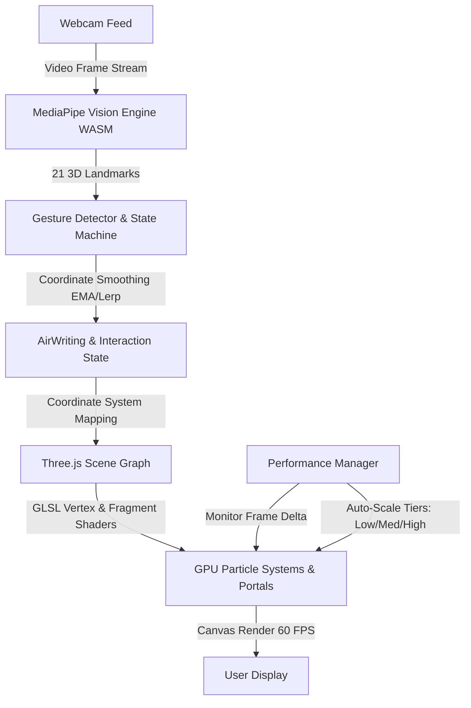

# 📄 AIR MAGIC — Complete Project Documentation & Interview Guide

> **Live Application**: [https://air-magic-six.vercel.app/](https://air-magic-six.vercel.app/)  
> **Source Code**: [https://github.com/rajasekar997455-bit/air-magic](https://github.com/rajasekar997455-bit/air-magic)  
> **Author**: Rajasekar  

---

## 📌 Table of Contents
1. [Executive Summary (The 30-Second Pitch)](#1-executive-summary-the-30-second-pitch)
2. [Comprehensive Project Description](#2-comprehensive-project-description)
3. [Core Feature Breakdown](#3-core-feature-breakdown)
4. [Complete Technology Stack](#4-complete-technology-stack)
5. [System Architecture & Data Flow](#5-system-architecture--data-flow)
6. [Interactive Gesture Guide](#6-interactive-gesture-guide)
7. [Engineering Challenges & Technical Solutions](#7-engineering-challenges--technical-solutions)
8. [Common Interview Questions & Answers](#8-common-interview-questions--answers)
9. [How to Run & Deploy Locally](#9-how-to-run--deploy-locally)

---

## 1. Executive Summary (The 30-Second Pitch)

> *"**AIR MAGIC** is an in-browser spatial computing application that turns any standard webcam into a touchless, gesture-controlled magical canvas. Without requiring expensive VR headsets or specialized sensor hardware, users can write glowing neon words in mid-air, cast elemental spells, summon 3D holographic creatures, and tear open multidimensional portals using natural hand gestures.*  
> *It runs 100% client-side using computer vision (MediaPipe via WebAssembly) and GPU shaders (Three.js/WebGL) at a silky-smooth 60 FPS."*

---

## 2. Comprehensive Project Description

AIR MAGIC bridges modern **Computer Vision** and **High-Performance 3D Computer Graphics** directly inside standard modern web browsers.

Traditional touch and mouse interfaces are constrained to 2D screens. AIR MAGIC translates human spatial gestures into real-time 3D coordinate space ($X, Y, Z$), allowing the user's hands to manipulate interactive particle fields, procedural creatures, and custom visual effects.

### Key Highlights:
- **Zero Hardware Barriers**: Uses any standard laptop webcam, tablet camera, or smartphone camera.
- **Client-Side Privacy**: Video streams never leave the user's device. All AI model inference occurs locally on device via WebAssembly (WASM).
- **GPU-Accelerated**: Heavy visual computations (point clouds, vortex physics, lighting) are handled by custom GLSL vertex and fragment shaders on the graphics card.

---

## 3. Core Feature Breakdown

### ✍️ Air Writing & Spatial Drawing
- Tracks the 3D tip of the index finger.
- Applies mathematical interpolation and smoothing (lerping) to generate glowing particle ribbons in mid-air.
- Provides real-time audio and visual particle burst feedback.

### 🌀 Multiverse Portals (8 Distinct Dimensions)
Tearing open a portal spawns complex particle physics simulations with unique GLSL shaders and audio:
1. **Galaxy Portal**: Swirling cosmic spiral galaxies and nebula dust.
2. **Cyber Portal**: Matrix-like digital geometry and cybernetic grid rings.
3. **Nature Portal**: Organic leaf particles and soft emerald lighting.
4. **Golden Portal**: Luminous solar corona and celestial rings.
5. **Ice Portal**: Crystalline frost fractals and sub-zero blizzard particles.
6. **Void Portal**: Gravitational singularity, event horizon, and light-bending black hole physics.
7. **Lava Portal**: Superheated magma turbulence and volcanic embers.
8. **Neon Portal**: Cyberpunk synthwave aesthetics and vibrant ultraviolet glow.

### 🦋 Interactive Holographic Creatures
- **Butterflies**: Flocking algorithms (Boids simulation) where creatures dynamically navigate 3D space and land on the user's fingers when hands are crossed.
- **Holographic Flowers**: Procedural geometry blooms with iridescent shading.

### ⚡ Elemental Spells & Jarvis HUD
- Interactive lightning arcs branching between fingertips.
- Futuristic spatial HUD displaying real-time tracking telemetry, FPS, and gesture confidence metrics.

---

## 4. Complete Technology Stack

| Layer | Technology | Role & Justification |
| :--- | :--- | :--- |
| **Frontend Framework** | **React 19 & TypeScript** | Component lifecycle management, strict type safety, modular UI structure |
| **Build Tool** | **Vite 8** | Instant HMR (Hot Module Replacement) and optimized tree-shaken production bundles |
| **3D Graphics Engine** | **Three.js & WebGL 2** | Scene graph hierarchy, perspective camera, 3D point cloud generation |
| **GPU Shaders** | **Custom GLSL** | High-performance vertex and fragment shaders for portal vortexes and trails |
| **Computer Vision AI** | **Google MediaPipe Tasks (WASM)** | 21-point 3D hand landmark detection executing client-side with SIMD acceleration |
| **UI & Styling** | **Tailwind CSS & Vanilla CSS** | Bespoke obsidian (`#0b090a`) and frost-white (`#ebf2fa`) spatial HUD design |
| **Audio Synthesis** | **Web Audio API** | Procedural sound effects and spatial acoustic feedback for spellcasting |
| **CI / CD & Hosting** | **GitHub & Vercel** | Git version control with automated zero-config production deployment over HTTPS |

---

## 5. System Architecture & Data Flow



1. **Video Ingestion**: WebRTC `getUserMedia()` grabs the camera feed.
2. **AI Inference**: MediaPipe Task model evaluates each frame in WebAssembly.
3. **Gesture Extraction**: Geometric distance vectors detect open palm, pinch, point, etc.
4. **Coordinate Transformation**: Screen-space camera coordinates are translated to Three.js world-space viewport vectors.
5. **Shader Pipeline**: GPU runs vertex and fragment passes to animate particles and portal physics.
6. **Adaptive Scaling**: `PerformanceManager` continuously throttles particle density to protect frame rate.

---

## 6. Interactive Gesture Guide

| Gesture | Action | How It Works |
| :---: | :--- | :--- |
| ☝️ | **Air Draw** | Extend index finger while keeping others curled. Moves 3D brush in air. |
| 🤏 | **Pinch Portal** | Pinch index finger and thumb together for 1.5 seconds to tear open a portal. |
| 🖐️ | **Move & Control** | Open all 5 fingers. Manipulates particle vortexes and disperses fields. |
| 🤟 | **Close Portal** | Extend 3 fingers to immediately dismiss active portal simulations. |
| 🤞 | **Cross Hands** | Bring both hands into frame. Holographic butterflies land on fingertips. |
| ✌️ | **Smile Aura** | Two fingers up (peace sign). Triggers ethereal particle smile aura. |

---

## 7. Engineering Challenges & Technical Solutions

### Challenge 1: Webcam Coordinate Jitter & Latency
- **Problem**: Raw coordinates from machine learning models suffer from high-frequency micro-jitter, causing air-written lines to appear shaky.
- **Solution**: Implemented an **Exponential Moving Average (EMA)** smoothing filter and vector interpolation (`lerp`). This dampens sensor noise while preserving low-latency responsiveness.

### Challenge 2: Client-Side Performance on Lower-End Hardware
- **Problem**: Simultaneously running a deep learning vision model and rendering thousands of 3D particles can cause severe thermal throttling and frame drops on budget laptops or mobile devices.
- **Solution**: Designed an autonomous **`PerformanceManager`** that calculates rolling 500ms FPS averages. If the frame rate drops below 32 FPS, it automatically downgrades particle density (`HIGH` ➜ `MEDIUM` ➜ `LOW`). When frame rates stabilize above 55 FPS, it smoothly steps back up.

### Challenge 3: Secure Contexts for Camera Permissions
- **Problem**: Modern web browsers strictly forbid camera access over insecure HTTP connections.
- **Solution**: Structured deployment on Vercel with automatic TLS/SSL certificates and custom Single Page Application (SPA) rewrite rules ([`vercel.json`](./vercel.json)), ensuring persistent HTTPS and direct route reliability (`/app`).

---

## 8. Common Interview Questions & Answers

### Q1: "Why did you use MediaPipe instead of training your own model?"
> *"MediaPipe Tasks Vision is specifically compiled for WebAssembly with SIMD acceleration. It runs directly inside the browser sandbox with zero backend server latency and zero API cost. By utilizing MediaPipe for the raw 21 landmarks, we were able to focus our engineering on custom gesture heuristic state machines, coordinate projection, and complex GPU shader graphics."*

### Q2: "How does the Air Writing math work in 3D?"
> *"Webcam coordinates only provide normalized 2D values ($X, Y \in [0, 1]$) with an estimated $Z$ depth. We transform these normalized coordinates using an inverse perspective projection matrix against Three.js's virtual camera frustum, mapping 2D pixel space into true 3D world units. We then record historical positions and construct dynamic Catmull-Rom spline curves or particle ribbons along the trajectory."*

### Q3: "How is privacy handled?"
> *"Privacy is 100% preserved. The video stream is processed completely client-side in browser memory and is never uploaded, recorded, or transmitted to any remote server."*

---

## 9. How to Run & Deploy Locally

### Prerequisites
- Node.js (v18+)
- Web browser with WebGL & Camera support

```bash
# 1. Clone repository
git clone https://github.com/rajasekar997455-bit/air-magic.git
cd air-magic

# 2. Install dependencies
npm install

# 3. Launch local dev server
npm run dev
```

### Production Build
```bash
npm run build
npm run preview
```

---

*Document Generated for AIR MAGIC • &copy; 2026 Rajasekar*
